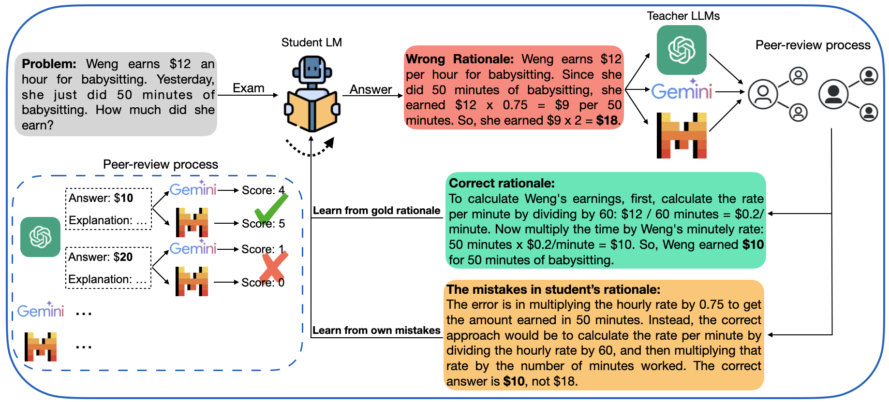

# Fault-Aware Distillation via Peer-Review (FAIR) approach
Code for the paper: "[Learning from Committee: Reasoning Distillation from a Mixture of Teachers with Peer-Review](https://arxiv.org/abs/2410.03663)", accepted by ACL 2025.

## Before You Start

